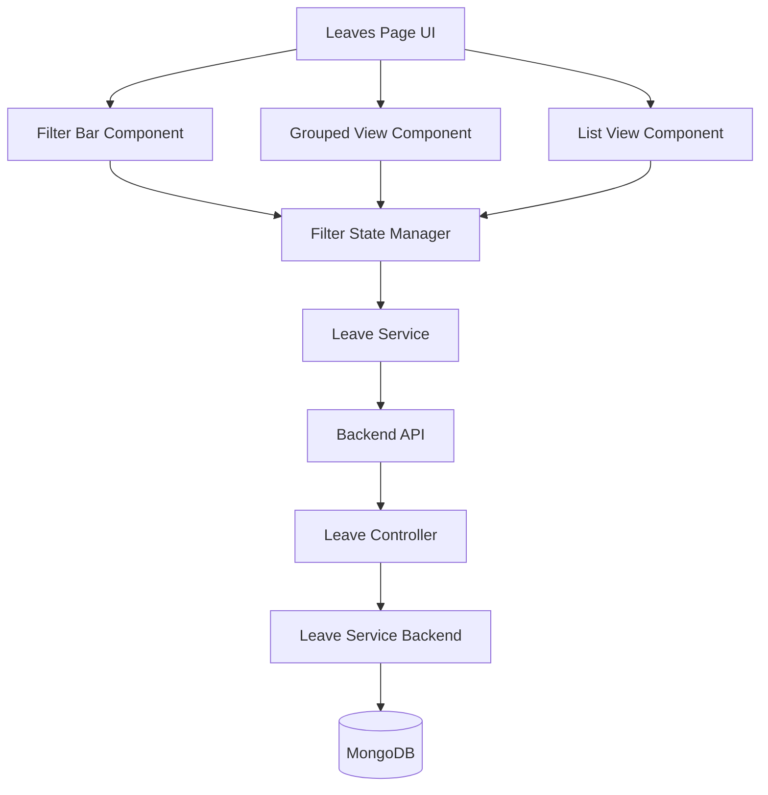

# Design Document: Leaves Search and Filter Enhancement

## Overview

This design document outlines the implementation of comprehensive search, filter, and grouping capabilities for the leaves management system. The feature will enhance both the frontend UI and backend API to support efficient querying and organization of leave requests.

The implementation will build upon the existing leave management infrastructure, adding client-side filtering and UI enhancements while maintaining the existing backend API structure that already supports filtering via query parameters.

## Architecture

### High-Level Architecture



### Component Hierarchy

```
Leaves Page
├── Filter Bar
│   ├── Search Input (Employee Name)
│   ├── Type Filter Dropdown
│   ├── Status Filter Dropdown
│   ├── Date Range Picker (From/To)
│   ├── Group By Selector
│   └── Clear Filters Button
├── Results Summary
│   └── Count Display
└── Leave Requests Display
    ├── Grouped View (when grouping active)
    │   └── Group Sections (collapsible)
    │       └── Leave Request Cards/Rows
    └── List View (default)
        └── Leave Request Table
```

## Components and Interfaces

### Frontend Components

#### 1. FilterBar Component

A new component that encapsulates all filtering controls.

**Props:**
```typescript
interface FilterBarProps {
  filters: LeaveFilters;
  onFilterChange: (filters: LeaveFilters) => void;
  onClearFilters: () => void;
  showEmployeeSearch: boolean; // Hide for employee role
  leaveTypes: string[];
  statuses: string[];
}
```

**State:**
```typescript
interface LeaveFilters {
  searchQuery: string;        // Employee name search
  type: string;               // Leave type filter
  status: string;             // Status filter
  startDate: string;          // Date range start
  endDate: string;            // Date range end
  groupBy: 'none' | 'employee' | 'type' | 'status';
}
```

#### 2. GroupedLeaveView Component

Displays leave requests organized by the selected grouping criteria.

**Props:**
```typescript
interface GroupedLeaveViewProps {
  leaves: LeaveApplication[];
  groupBy: 'employee' | 'type' | 'status';
  onLeaveAction: (leaveId: string, action: 'approve' | 'reject') => void;
  canApprove: boolean;
  userRole: string;
}
```

**Internal Structure:**
```typescript
interface LeaveGroup {
  key: string;              // Group identifier
  label: string;            // Display label
  count: number;            // Number of items
  leaves: LeaveApplication[];
  isExpanded: boolean;      // Collapse state
}
```

#### 3. Enhanced Leaves Page

The main page component will be refactored to integrate filtering and grouping.

**State Management:**
```typescript
interface LeavesPageState {
  leaves: LeaveApplication[];
  filteredLeaves: LeaveApplication[];
  filters: LeaveFilters;
  leaveBalance: LeaveBalance | null;
  isLoading: boolean;
  isSubmitting: boolean;
  error: string | null;
  formData: LeaveFormData;
}
```

### Backend Enhancements

The backend already supports filtering through query parameters in the `getLeaves` endpoint. We'll leverage this existing functionality.

**Existing Query Parameters (already implemented):**
- `userId` - Filter by user
- `type` - Filter by leave type
- `status` - Filter by status
- `startDate` - Filter by date range start
- `endDate` - Filter by date range end
- `page` - Pagination
- `limit` - Results per page
- `sortBy` - Sort field
- `sortOrder` - Sort direction

**No backend changes required** - the existing API already supports all necessary filtering capabilities.

## Data Models

### Frontend Types

```typescript
// Extended from existing LeaveApplication interface
interface LeaveApplication {
  _id: string;
  userId: string;
  type: 'Sick' | 'Casual' | 'Earned' | 'Maternity' | 'Paternity';
  from: string;
  to: string;
  totalDays: number;
  reason: string;
  status: 'Pending' | 'Approved' | 'Rejected';
  appliedAt: string;
  reviewedBy?: string;
  reviewedAt?: string;
  reviewComments?: string;
  user?: {
    name: string;
    email: string;
    department: string;
    position: string;
  };
  reviewer?: {
    name: string;
    email: string;
  };
}

// Filter state
interface LeaveFilters {
  searchQuery: string;
  type: string;
  status: string;
  startDate: string;
  endDate: string;
  groupBy: 'none' | 'employee' | 'type' | 'status';
}

// Constants
const LEAVE_TYPES = ['Sick', 'Casual', 'Earned', 'Maternity', 'Paternity'];
const LEAVE_STATUSES = ['Pending', 'Approved', 'Rejected'];
const GROUP_BY_OPTIONS = [
  { value: 'none', label: 'No Grouping' },
  { value: 'employee', label: 'Group by Employee' },
  { value: 'type', label: 'Group by Leave Type' },
  { value: 'status', label: 'Group by Status' }
];
```

## Implementation Strategy

### Phase 1: Client-Side Filtering

Implement filtering logic on the frontend using the data already fetched from the backend. This provides immediate responsiveness without additional API calls.

**Filtering Logic:**
```typescript
function filterLeaves(
  leaves: LeaveApplication[],
  filters: LeaveFilters
): LeaveApplication[] {
  return leaves.filter(leave => {
    // Employee name search (case-insensitive)
    if (filters.searchQuery) {
      const searchLower = filters.searchQuery.toLowerCase();
      const employeeName = leave.user?.name?.toLowerCase() || '';
      if (!employeeName.includes(searchLower)) {
        return false;
      }
    }
    
    // Type filter
    if (filters.type && filters.type !== 'all') {
      if (leave.type !== filters.type) {
        return false;
      }
    }
    
    // Status filter
    if (filters.status && filters.status !== 'all') {
      if (leave.status !== filters.status) {
        return false;
      }
    }
    
    // Date range filter
    if (filters.startDate) {
      const leaveStart = new Date(leave.from);
      const filterStart = new Date(filters.startDate);
      if (leaveStart < filterStart) {
        return false;
      }
    }
    
    if (filters.endDate) {
      const leaveStart = new Date(leave.from);
      const filterEnd = new Date(filters.endDate);
      if (leaveStart > filterEnd) {
        return false;
      }
    }
    
    return true;
  });
}
```

**Grouping Logic:**
```typescript
function groupLeaves(
  leaves: LeaveApplication[],
  groupBy: 'employee' | 'type' | 'status'
): LeaveGroup[] {
  const groups = new Map<string, LeaveApplication[]>();
  
  leaves.forEach(leave => {
    let key: string;
    let label: string;
    
    switch (groupBy) {
      case 'employee':
        key = leave.userId;
        label = leave.user?.name || 'Unknown';
        break;
      case 'type':
        key = leave.type;
        label = leave.type;
        break;
      case 'status':
        key = leave.status;
        label = leave.status;
        break;
    }
    
    if (!groups.has(key)) {
      groups.set(key, []);
    }
    groups.get(key)!.push(leave);
  });
  
  return Array.from(groups.entries()).map(([key, leaves]) => ({
    key,
    label: leaves[0].user?.name || key,
    count: leaves.length,
    leaves,
    isExpanded: true
  }));
}
```

### Phase 2: UI Components

#### Filter Bar Layout

```
┌─────────────────────────────────────────────────────────────────┐
│ [Search Employee...] [Type ▼] [Status ▼] [From] [To] [Group ▼] │
│                                            [Clear All Filters]   │
└─────────────────────────────────────────────────────────────────┘
```

#### Grouped View Layout

```
┌─────────────────────────────────────────────────────────────────┐
│ ▼ John Doe (3 requests)                                         │
│   ├─ Sick Leave | Jan 15-17 | Pending                          │
│   ├─ Casual Leave | Feb 10-12 | Approved                       │
│   └─ Earned Leave | Mar 5-9 | Pending                          │
│                                                                  │
│ ▼ Jane Smith (2 requests)                                       │
│   ├─ Sick Leave | Jan 20-22 | Approved                         │
│   └─ Casual Leave | Feb 15-16 | Rejected                       │
└─────────────────────────────────────────────────────────────────┘
```

### Phase 3: State Management

Use React hooks for state management:

```typescript
// Custom hook for filter management
function useLeaveFilters(initialLeaves: LeaveApplication[]) {
  const [filters, setFilters] = useState<LeaveFilters>({
    searchQuery: '',
    type: 'all',
    status: 'all',
    startDate: '',
    endDate: '',
    groupBy: 'none'
  });
  
  const [filteredLeaves, setFilteredLeaves] = useState(initialLeaves);
  
  useEffect(() => {
    const filtered = filterLeaves(initialLeaves, filters);
    setFilteredLeaves(filtered);
  }, [initialLeaves, filters]);
  
  const updateFilter = (key: keyof LeaveFilters, value: any) => {
    setFilters(prev => ({ ...prev, [key]: value }));
  };
  
  const clearFilters = () => {
    setFilters({
      searchQuery: '',
      type: 'all',
      status: 'all',
      startDate: '',
      endDate: '',
      groupBy: 'none'
    });
  };
  
  const hasActiveFilters = () => {
    return filters.searchQuery !== '' ||
           filters.type !== 'all' ||
           filters.status !== 'all' ||
           filters.startDate !== '' ||
           filters.endDate !== '' ||
           filters.groupBy !== 'none';
  };
  
  return {
    filters,
    filteredLeaves,
    updateFilter,
    clearFilters,
    hasActiveFilters
  };
}
```

## Error Handling

### Validation

1. **Date Range Validation:**
   - End date must not be before start date
   - Display inline error message if validation fails
   - Disable submit/apply until validation passes

2. **Search Input:**
   - Debounce search input (300ms) to avoid excessive filtering
   - Handle empty results gracefully with "No results found" message

### Error States

```typescript
interface FilterError {
  field: string;
  message: string;
}

// Example validation
function validateDateRange(startDate: string, endDate: string): FilterError | null {
  if (startDate && endDate) {
    const start = new Date(startDate);
    const end = new Date(endDate);
    
    if (end < start) {
      return {
        field: 'endDate',
        message: 'End date cannot be before start date'
      };
    }
  }
  
  return null;
}
```

## Testing Strategy

### Unit Tests

1. **Filter Logic Tests:**
   - Test each filter criterion independently
   - Test combined filters
   - Test edge cases (empty data, no matches)

2. **Grouping Logic Tests:**
   - Test grouping by each criterion
   - Test empty groups
   - Test single-item groups

3. **Validation Tests:**
   - Test date range validation
   - Test filter state management

### Integration Tests

1. **Component Integration:**
   - Test FilterBar updates filter state
   - Test filter state updates displayed leaves
   - Test clear filters resets all controls

2. **User Workflows:**
   - Apply single filter
   - Apply multiple filters
   - Clear filters
   - Switch between grouping modes
   - Expand/collapse groups

### Manual Testing Scenarios

1. **Admin User:**
   - Search for employee by name
   - Filter by leave type
   - Filter by status
   - Apply date range
   - Group by employee, type, and status
   - Clear all filters

2. **Employee User:**
   - Verify employee search is hidden
   - Filter own leaves by type
   - Filter by status
   - Apply date range
   - Group by type and status

3. **Performance:**
   - Test with large dataset (100+ leaves)
   - Verify filtering is responsive (<500ms)
   - Test rapid filter changes

## Performance Considerations

### Optimization Strategies

1. **Debouncing:**
   - Debounce search input to reduce filtering frequency
   - Use 300ms delay for optimal UX

2. **Memoization:**
   - Memoize filtered results using `useMemo`
   - Memoize grouped results using `useMemo`
   - Prevent unnecessary re-renders

3. **Virtual Scrolling (Future Enhancement):**
   - If dataset grows beyond 200 items, implement virtual scrolling
   - Use libraries like `react-window` or `react-virtual`

### Code Example

```typescript
// Memoized filtering
const filteredLeaves = useMemo(() => {
  return filterLeaves(leaves, filters);
}, [leaves, filters]);

// Memoized grouping
const groupedLeaves = useMemo(() => {
  if (filters.groupBy === 'none') return null;
  return groupLeaves(filteredLeaves, filters.groupBy);
}, [filteredLeaves, filters.groupBy]);

// Debounced search
const debouncedSearch = useMemo(
  () => debounce((value: string) => {
    updateFilter('searchQuery', value);
  }, 300),
  []
);
```

## Accessibility

### Keyboard Navigation

- All filter controls must be keyboard accessible
- Tab order: Search → Type → Status → Start Date → End Date → Group By → Clear
- Enter key submits/applies filters
- Escape key clears search input

### Screen Reader Support

- Label all form controls with descriptive labels
- Announce filter results count changes
- Announce when filters are cleared
- Use ARIA attributes for expandable groups

### Visual Indicators

- Clear visual indication of active filters
- Highlight selected filter options
- Show loading states during filtering
- Display empty state with helpful message

## Security Considerations

1. **Role-Based Filtering:**
   - Employees can only see their own leaves (enforced by backend)
   - Admin/HR can see all leaves
   - Employee search hidden for employee role

2. **Input Sanitization:**
   - Sanitize search query to prevent XSS
   - Validate date inputs
   - Use type-safe filter values

3. **Data Privacy:**
   - Don't expose sensitive data in filter options
   - Respect existing authorization rules

## Future Enhancements

1. **Advanced Filters:**
   - Filter by department
   - Filter by date applied
   - Filter by reviewer

2. **Saved Filters:**
   - Allow users to save frequently used filter combinations
   - Quick access to saved filters

3. **Export Functionality:**
   - Export filtered results to CSV/Excel
   - Include filter criteria in export

4. **Analytics:**
   - Show filter usage statistics
   - Suggest common filter combinations

5. **Server-Side Filtering:**
   - For very large datasets, move filtering to backend
   - Implement pagination with filters
   - Add search indexing for performance
