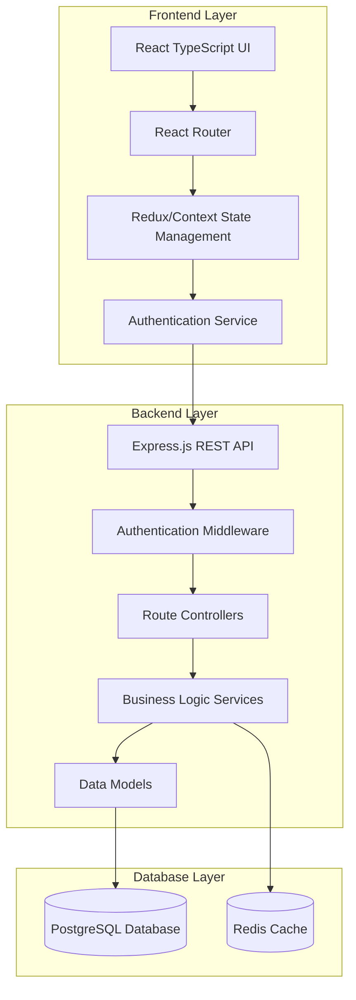
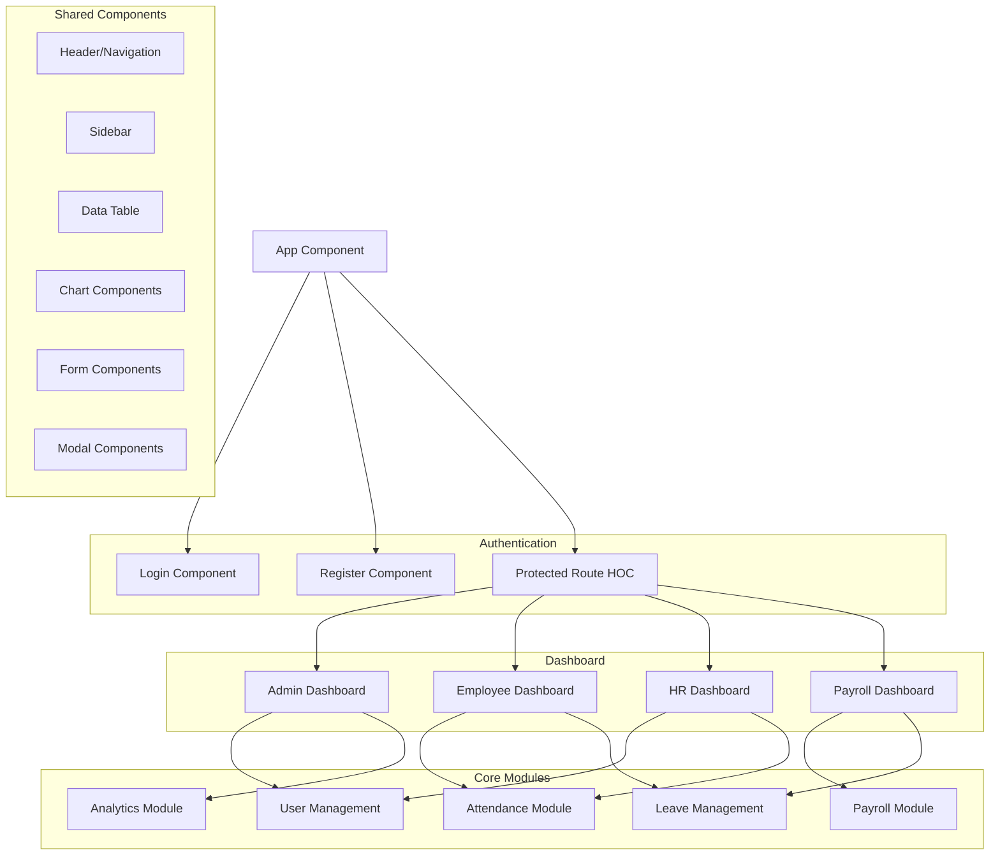

# WorkZen HRMS Design Document

## Overview

WorkZen is designed as a modern, scalable HRMS with a React TypeScript frontend and Node.js backend. The system follows a modular architecture with clear separation of concerns, role-based access control, and seamless data integration between HR modules.

The architecture emphasizes:
- Clean, maintainable code structure
- Secure role-based access control
- Real-time data synchronization
- Responsive user interface
- Scalable database design
- RESTful API design patterns

## Architecture

### System Architecture



### Technology Stack

**Frontend:**
- React 19 with TypeScript
- Vite for build tooling
- React Router for navigation
- Context API or Redux Toolkit for state management
- Axios for API communication
- Chart.js or Recharts for analytics visualization
- Tailwind CSS or Material-UI for styling

**Backend:**
- Node.js with Express.js
- TypeScript for type safety
- JWT for authentication
- bcrypt for password hashing
- Joi or Zod for input validation
- Winston for logging

**Database:**
- PostgreSQL for primary data storage
- Redis for session management and caching
- Database migrations with Knex.js or Prisma

## Components and Interfaces

### Frontend Components Architecture



### Backend API Structure

```
/api/v1/
├── /auth
│   ├── POST /login
│   ├── POST /register
│   ├── POST /logout
│   └── GET /profile
├── /users
│   ├── GET /users (Admin/HR only)
│   ├── POST /users (Admin only)
│   ├── PUT /users/:id (Admin/HR only)
│   ├── DELETE /users/:id (Admin only)
│   └── GET /users/:id/profile
├── /attendance
│   ├── POST /attendance/checkin
│   ├── POST /attendance/checkout
│   ├── GET /attendance/logs
│   └── GET /attendance/reports
├── /leave
│   ├── POST /leave/apply
│   ├── GET /leave/requests
│   ├── PUT /leave/:id/approve
│   ├── PUT /leave/:id/reject
│   └── GET /leave/balance
├── /payroll
│   ├── POST /payroll/process
│   ├── GET /payroll/payslips
│   ├── GET /payroll/reports
│   └── PUT /payroll/salary/:userId
└── /analytics
    ├── GET /analytics/dashboard
    ├── GET /analytics/attendance
    ├── GET /analytics/leave
    └── GET /analytics/payroll
```

### Role-Based Access Control Matrix

| Feature | Admin | HR Officer | Payroll Officer | Employee |
|---------|-------|------------|-----------------|----------|
| User Management | Full CRUD | Read/Update profiles | Read only | Read own profile |
| Attendance | View all | View all | View all | Mark own, view own |
| Leave Management | View all | Allocate/View | Approve/Reject | Apply/View own |
| Payroll | View all | No access | Full access | View own payslips |
| Analytics | Full access | HR metrics | Payroll metrics | Personal metrics |
| System Settings | Full access | No access | No access | No access |

## Data Models

### User Model
```typescript
interface User {
  id: string;
  email: string;
  password: string; // hashed
  firstName: string;
  lastName: string;
  role: 'ADMIN' | 'HR_OFFICER' | 'PAYROLL_OFFICER' | 'EMPLOYEE';
  employeeId: string;
  department: string;
  position: string;
  joinDate: Date;
  salary: number;
  isActive: boolean;
  createdAt: Date;
  updatedAt: Date;
}
```

### Attendance Model
```typescript
interface Attendance {
  id: string;
  userId: string;
  date: Date;
  checkIn: Date;
  checkOut?: Date;
  totalHours?: number;
  status: 'PRESENT' | 'ABSENT' | 'LATE' | 'HALF_DAY';
  notes?: string;
  createdAt: Date;
  updatedAt: Date;
}
```

### Leave Model
```typescript
interface Leave {
  id: string;
  userId: string;
  leaveType: 'SICK' | 'CASUAL' | 'ANNUAL' | 'MATERNITY' | 'PATERNITY';
  startDate: Date;
  endDate: Date;
  totalDays: number;
  reason: string;
  status: 'PENDING' | 'APPROVED' | 'REJECTED';
  appliedAt: Date;
  reviewedBy?: string;
  reviewedAt?: Date;
  reviewComments?: string;
}
```

### Payroll Model
```typescript
interface Payroll {
  id: string;
  userId: string;
  payPeriod: string; // YYYY-MM format
  basicSalary: number;
  allowances: number;
  grossSalary: number;
  pfDeduction: number;
  professionalTax: number;
  otherDeductions: number;
  totalDeductions: number;
  netSalary: number;
  workingDays: number;
  presentDays: number;
  paidLeaveDays: number;
  unpaidLeaveDays: number;
  status: 'DRAFT' | 'PROCESSED' | 'PAID';
  processedAt?: Date;
  createdAt: Date;
}
```

### Leave Balance Model
```typescript
interface LeaveBalance {
  id: string;
  userId: string;
  year: number;
  sickLeave: number;
  casualLeave: number;
  annualLeave: number;
  usedSickLeave: number;
  usedCasualLeave: number;
  usedAnnualLeave: number;
  updatedAt: Date;
}
```

## Error Handling

### Frontend Error Handling
- Global error boundary for React components
- Axios interceptors for API error handling
- User-friendly error messages with fallback options
- Loading states and error states for all async operations
- Form validation with real-time feedback

### Backend Error Handling
- Centralized error handling middleware
- Structured error responses with consistent format
- Input validation with detailed error messages
- Database error handling with appropriate HTTP status codes
- Logging of all errors for debugging and monitoring

### Error Response Format
```typescript
interface ErrorResponse {
  success: false;
  error: {
    code: string;
    message: string;
    details?: any;
    timestamp: string;
  };
}
```

## Testing Strategy

### Frontend Testing
- Unit tests for components using React Testing Library
- Integration tests for user workflows
- E2E tests using Cypress or Playwright
- Visual regression testing for UI components
- Accessibility testing with axe-core

### Backend Testing
- Unit tests for services and utilities using Jest
- Integration tests for API endpoints
- Database testing with test database
- Authentication and authorization testing
- Performance testing for critical endpoints

### Test Coverage Goals
- Minimum 80% code coverage for critical business logic
- 100% coverage for authentication and authorization
- Integration tests for all user workflows
- Performance benchmarks for database queries

### Testing Environment
- Separate test databases for isolation
- Mock external services and APIs
- Automated testing in CI/CD pipeline
- Regular security testing and vulnerability scanning

## Security Considerations

### Authentication & Authorization
- JWT tokens with appropriate expiration
- Refresh token mechanism for session management
- Role-based access control at API level
- Password strength requirements and hashing
- Account lockout after failed login attempts

### Data Protection
- Input sanitization and validation
- SQL injection prevention with parameterized queries
- XSS protection with content security policies
- HTTPS enforcement for all communications
- Sensitive data encryption at rest

### API Security
- Rate limiting to prevent abuse
- CORS configuration for frontend access
- API versioning for backward compatibility
- Request logging for audit trails
- Regular security updates and patches